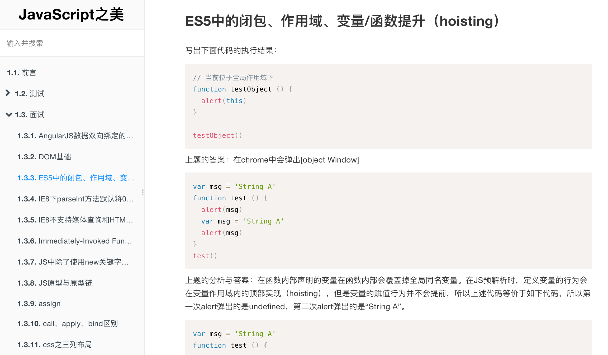

# GitBook Theme - for websites focusing on code

<p align="center">
  <a href="https://npmcharts.com/compare/gitbook-plugin-theme-code?minimal=true">
    
  </a>
  <a href="https://www.npmjs.com/package/gitbook-plugin-theme-code">
    
  </a>
  <a href="https://www.npmjs.com/package/gitbook-plugin-theme-code">
    
  </a>
</p>

This is based on the default theme for GitBook since version `3.0.0`. Currently there are no big changes but some bug fixes and a site title added to the top of the sidebar.

An example snapshot:



Example configuration (book.json):

```json
{
  "title": "Site Title",
  "author": "Author Name",
  "authorHomepage": "http://www.example.com",
  "baiduStatisticsCode": "",
  "description": "site description",
  "language": "zh-hans",
  "copyright": "All Rights Reserved",
  "variables": {
    "homePage": "/"
  },
  "plugins": [
    "theme-code",
    "splitter",
    "prism",
    "folding-chapters",
    "-sharing"
  ],
  "pluginsConfig": {
    "theme-default": {
      "showLevel": true
    }
  }
}
```

## To developers

If you want to develop GitBook theme and publish it to npm repository, you should name your package to somewhat like `gitbook-plugin-theme-themename`. For details, please refer to the [official online document](https://toolchain.gitbook.com/). Here are some tips for you.


### Tip 1: Test your plugin locally

In the plugin's folder, run:

```bash
npm link
```

Then in your book's folder:

```bash
npm link gitbook-plugin-plugin-name
```

### Tip 2: build on base of default official theme for GitBook

Actually, this project is also built on base of the [GitBook Default Theme](https://github.com/GitbookIO/theme-default). However, if you want to use the default theme, you should remember to fix two bugs showed bellow (At first I would like to send a pull request to the author of that project, but when I open its github page, I found many PR unhandled, so I planned not to waste my time -_-):

In the file `src/js/theme/navigation.js`, you could find code like this:

```javascript
// Get current page summary chapters
$chapters = $('.book-summary .summary .chapter')
    .filter(function() {
        var $link = $(this).children('a'),
            href  = null;
    
        // Chapter doesn't have a link
        if (!$link.length) {
            return false;
        }
        else {
            href = $link.attr('href').split('#')[0];
        }
    
        var resolvedRef = url.resolve(window.location.pathname, href);
        return window.location.pathname == resolvedRef;
    });
```

You should replace the code `window.location.pathname == resolvedRef;` to `decodeURIComponent(window.location.pathname) == decodeURIComponent(resolvedRef)`.

The bug can be repeated if your url in the browser contains special characters such as Chinese, because equality judgement in the code will fail in that case: `window.location.pathname` will get the encoded characters, while `$link.attr('href')` will get the original characters.

Here is another bug, in `_layouts/website/summary.html`:

```html

    </a>

    </span>

```

The code above should be replaced by the code below:

```html

    </a>

    </span>

```

Otherwise, you will find sometime the HTML tag `SPAN` is closed by tag `A`.
